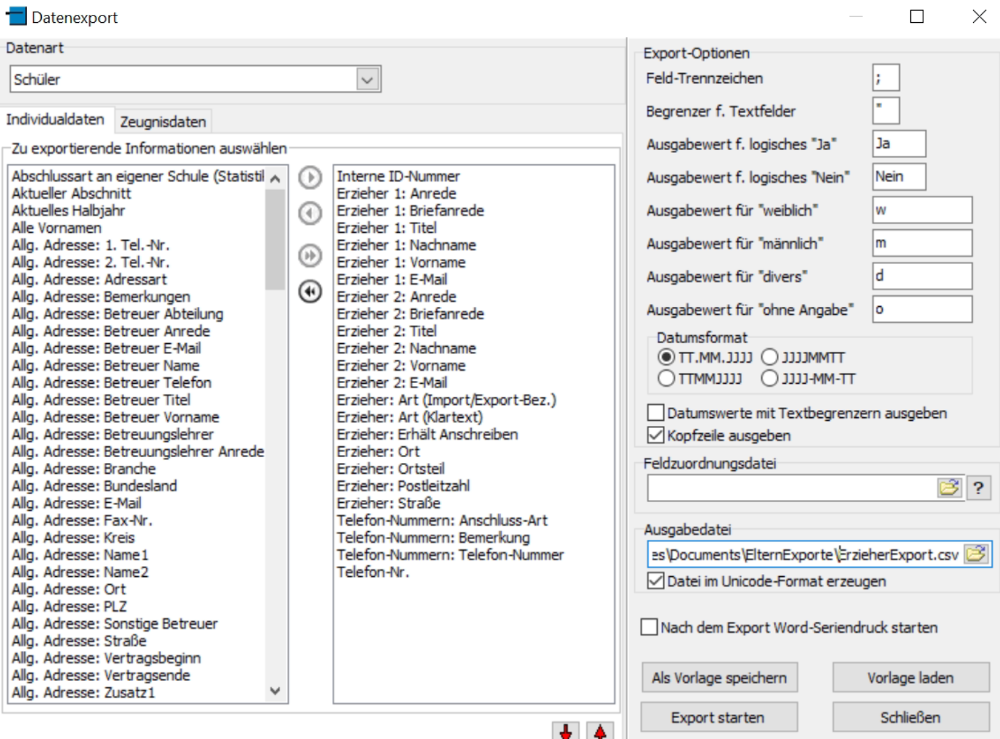

# SchildNRW Export Einstellungen

In dieser Anleitung wird beschrieben, wie Sie die richtigen Einstellungen für den Export der **AnsprechpartnerExport.csv** und der **ErzieherExport.csv** aus SchildNRW vornehmen. Bitte folgen Sie den folgenden Schritten genau, um sicherzustellen, dass die benötigten Daten korrekt exportiert werden.

## 1. Export der AnsprechpartnerExport.csv

### Schritt 1: Exporteinstellungen öffnen
- Öffnen Sie in SchildNRW den Datenexport-Bereich und wählen Sie die **Datenart** "telefonische Ansprechpartner" aus.

### Schritt 2: Auswahl der zu exportierenden Informationen
- Wählen Sie die folgenden Spalten aus, indem Sie sie aus der Liste rechts in die linke Liste verschieben:
  - **Anschluss-Art**
  - **Bemerkung**
  - **Schüler_ID**
  - **Schüler-Klasse**
  - **Schüler-Nachname**
  - **Schüler-Vorname**
  - **Telefon-Nummer**

### Schritt 3: Exportoptionen einstellen
- Setzen Sie die folgenden Einstellungen auf der rechten Seite:
  - **Feld-Trennzeichen**: `;`
  - **Begrenzer f. Textfelder**: `"` (Anführungszeichen)
  - **Kopfzeile ausgeben**: ✔️ (aktivieren)
  - **Datei im Unicode-Format erzeugen**: ✔️ (aktivieren)

### Beispiel-Screenshot der Einstellungen:

## 2. Export der ErzieherExport.csv

### Schritt 1: Exporteinstellungen öffnen
- Wählen Sie in SchildNRW die **Datenart** "Schüler" aus.

### Schritt 2: Auswahl der zu exportierenden Informationen
- Wählen Sie die folgenden Spalten aus der rechten Liste und verschieben Sie sie in die linke Liste:
  - **Interne ID-Nummer**
  - **Erzieher 1: Anrede**
  - **Erzieher 1: Briefanrede**
  - **Erzieher 1: Titel**
  - **Erzieher 1: Nachname**
  - **Erzieher 1: Vorname**
  - **Erzieher 1: E-Mail**
  - **Erzieher 2: Anrede**
  - **Erzieher 2: Briefanrede**
  - **Erzieher 2: Titel**
  - **Erzieher 2: Nachname**
  - **Erzieher 2: Vorname**
  - **Erzieher 2: E-Mail**
  - **Erzieher: Art (Import/Export-Bez.)**
  - **Erzieher: Art (Klartext)**
  - **Erzieher: Erhält Anschreiben**
  - **Erzieher: Ort**
  - **Erzieher: Ortsteil**
  - **Erzieher: Postleitzahl**
  - **Erzieher: Straße**
  - **Telefon-Nummern: Anschluss-Art**
  - **Telefon-Nummern: Bemerkung**
  - **Telefon-Nummern: Telefon-Nummer**
  - **Telefon-Nr.**

### Schritt 3: Exportoptionen einstellen
- Setzen Sie die folgenden Einstellungen auf der rechten Seite:
  - **Feld-Trennzeichen**: `;`
  - **Begrenzer f. Textfelder**: `"` (Anführungszeichen)
  - **Kopfzeile ausgeben**: ✔️ (aktivieren)
  - **Datei im Unicode-Format erzeugen**: ✔️ (aktivieren)

### Beispiel-Screenshot der Einstellungen:

## Hinweis
Bitte stellen Sie sicher, dass Sie das richtige Verzeichnis für die Exportdatei angeben, damit Sie die CSV-Dateien anschließend problemlos in das "SchildNRW-WebUntis Erzieher-Konvertierer"-Programm importieren können.

