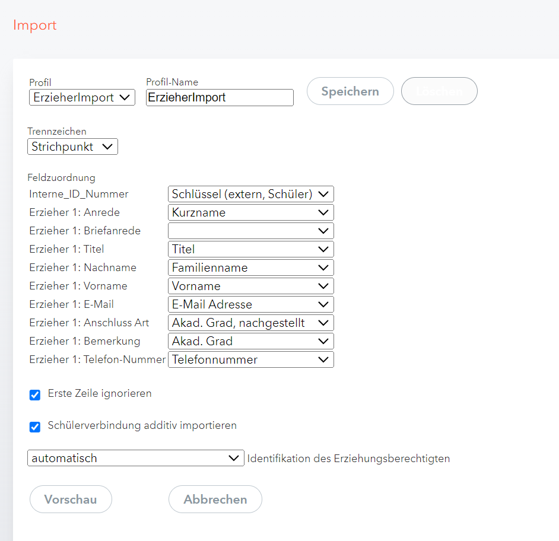

# WebUntis Import Einstellungen

In dieser Anleitung wird beschrieben, wie Sie die exportierten Daten mit dem "SchildNRW-WebUntis Erzieher-Konvertierer" in WebUntis importieren. Die Einstellungen müssen sorgfältig vorgenommen werden, um eine korrekte Zuordnung der Erzieherdaten zu gewährleisten.

## Schritt 1: Importmenü in WebUntis öffnen
- Öffnen Sie das Import-Menü in WebUntis und speicherns Sie folgende Einstellungen als Importvorlage z.B.: **ErzieherImport**.

## Schritt 2: Trennzeichen auswählen
- Stellen Sie sicher, dass als **Trennzeichen** `Strichpunkt (;)` ausgewählt ist.

## Schritt 3: Feldzuordnung
Nehmen Sie die Zuordnung der Felder entsprechend den Spalten der CSV-Dateien vor. Folgende Zuordnungen empfehle ich:

| CSV-Feld                      | WebUntis-Feldzuordnung           |
|-------------------------------|----------------------------------|
| **Interne_ID_Nummer**         | Schlüssel (extern, Schüler)      |
| **Erzieher 1: Anrede**        | Kurzname                         |
| **Erzieher 1: Briefanrede**   | (leer lassen)                    |
| **Erzieher 1: Titel**         | Titel                            |
| **Erzieher 1: Nachname**      | Familienname                     |
| **Erzieher 1: Vorname**       | Vorname                          |
| **Erzieher 1: E-Mail**        | E-Mail Adresse                   |
| **Erzieher 1: Anschluss Art** | Akad. Grad, nachgestellt         |
| **Erzieher 1: Bemerkung**     | Akad. Grad                       |
| **Erzieher 1: Telefon-Nummer**| Telefonnummer                    |

Falls Sie mehrere Erzieher-Datensätze importieren können Sie diese Vorlage für alle Erzieher Import Dateien verwenden.

## Schritt 4: Weitere Einstellungen
- Aktivieren Sie die Checkbox **Erste Zeile ignorieren**, da die erste Zeile der CSV-Datei die Kopfzeilen enthält.
- Aktivieren Sie außerdem die Option **Schülerverbindung additiv importieren**, um bestehende Verbindungen nicht zu überschreiben, sondern nur hinzuzufügen.
- Erst am Ende des Schuljahres sollten Sie diesen Haken entfernen.

### Schritt 5: Identifikation des Erziehungsberechtigten
- Stellen Sie sicher, dass **automatisch** unter "Identifikation des Erziehungsberechtigten" ausgewählt ist.

### Beispiel-Screenshot der Import-Einstellungen:

## Abschluss des Imports
Nachdem Sie die Einstellungen vorgenommen haben, klicken Sie auf **Vorschau**, um die Daten zu überprüfen. Wenn alles korrekt ist, führen Sie den Importvorgang bzw. die Importvorgänge aus.

Gerade am Anfang wird dabei auffallen, das einige Erzieherdaten in Schild doppelt vorhanden sind. Dies muss für einen reibungsfreien Import natürlich korrigiert werden. 

Anschließend sollten die Erzieherdaten korrekt in WebUntis importiert sein und die Telefonnummern sowie weiteren Details pro Erzieher richtig zugeordnet werden.

